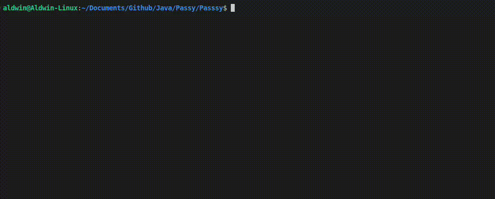

# Passy

## Summary: Store passwords locally to your computer without having to pay or rely on online services which sometimes unreliable and hackable.

### Description: The app uses the latest cryptechnology, salting and encryption. Creates unreadable and encrypted .txt file (located in enc folder, must initiate the App with the command "file") to store passwords so nobody can see or read your passwords.
### E.g.

Very simple and straightforward. Store password, get password, override password.

## Demo:

   
## Important !!:
Write file when prompted to initiate the App  

## Steps on how to use it:

### Commands:

Write:  
file to initiate this project (THIS IS IMPORTANT!! BEFORE YOU CAN USE THE APP !!)  

enc to Encode  

ovr to Override  
  

dec to Decypher  

see to see all Accounts  

any questions, email aldwindrodriguez@gmail.com.

